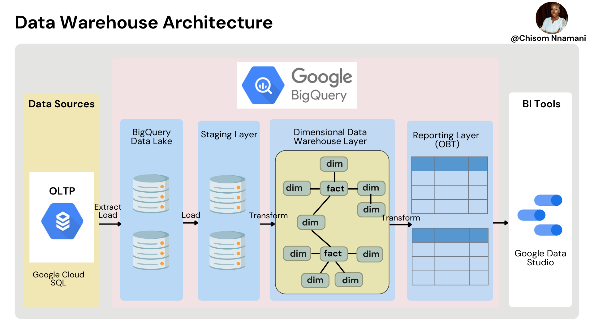
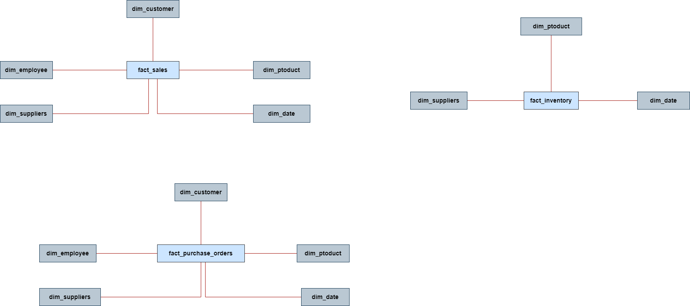
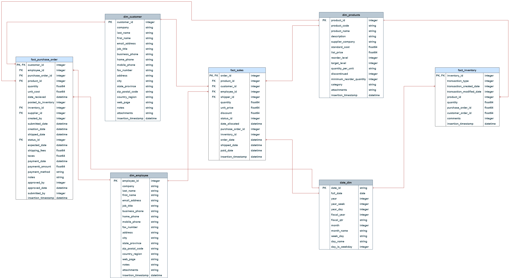
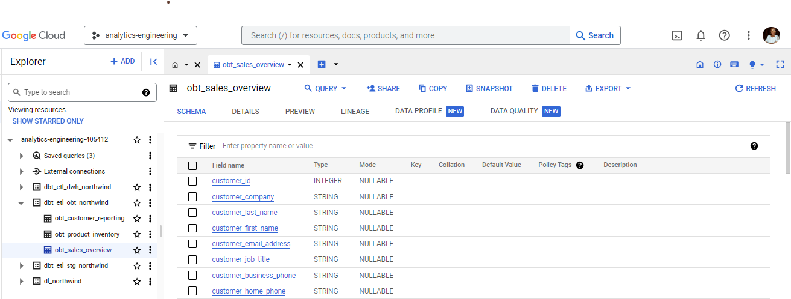

## ภาพรวมโครงการ (Project Overview)
โครงการนี้มีเป้าหมายเพื่อสร้างระบบคลังข้อมูล (Data Warehouse) และระบบการแปลงข้อมูล (Analytics Engineering Pipeline) จากฐานข้อมูลระบบธุรกรรมการค้าเดิม (**Northwind OLTP**) ไปสู่ **Google BigQuery** โดยใช้แนวคิดการจำลองข้อมูลแบบ **Star Schema (Dimensional Modeling)** และ **One Big Table (OBT)** เพื่อรองรับการทำรายงานเชิงลึก (Business Intelligence) และแดชบอร์ดบน **Google Data Studio (Looker Studio)**

---

##  1. สถาปัตยกรรมคลังข้อมูล (Data Warehouse Architecture)

ระบบถูกออกแบบเป็น Data Pipeline แบบ End-to-End ตั้งแต่ต้นทางจนถึงการสร้างรายงาน โดยแบ่งเลเยอร์การประมวลผลบน Google Cloud Platform ดังนี้:

1. **Data Source (OLTP):** ข้อมูลธุรกรรมต้นทางจัดเก็บบน **Google Cloud SQL**
2. **Google BigQuery Data Lake (`dl_northwind`):** พื้นที่พักข้อมูลดิบ (Raw Data) ที่ถูกสกัดและโหลดเข้ามา (Extract & Load)
3. **Staging Layer (`dbt_etl_stg_northwind`):** เลเยอร์สำหรับทำ Data Cleansing, Data Type Casting และ Deduplication เบื้องต้น
4. **Dimensional Data Warehouse Layer (`dbt_etl_dwh_northwind`):** โครงสร้างคลังข้อมูลที่ถูกจัดรูปแบบเป็น **Star Schema** (Fact & Dimension Tables)
5. **Reporting Layer / OBT (`dbt_etl_obt_northwind`):** การ Denormalize ข้อมูลรวมเป็นตารางเดี่ยวขนาดใหญ่ (**One Big Table**) เพื่อเพิ่มประสิทธิภาพในการ Query
6. **BI & Visualization:** นำเสนอผลลัพธ์ผ่าน **Google Data Studio**

---

## 2. แหล่งข้อมูลต้นทางและฐานข้อมูล OLTP (Raw Datasets & OLTP ERD)

ชุดข้อมูลตั้งต้นประกอบด้วยตารางข้อมูลการทำธุรกรรมแบบครบวงจรของระบบ Northwind:

### รายการไฟล์ชุดข้อมูลดิบ (Source Tables):
* **Core Business Tables:**
  * `customers`: ข้อมูลลูกค้า ข้อมูลติดต่อ และที่อยู่
  * `employees`: ข้อมูลพนักงาน ตำแหน่ง และสายบังคับบัญชา
  * `products`: ข้อมูลสินค้า ราคาต้นทุน ราคาขาย และระดับสต็อก
  * `orders`: ข้อมูลหัวบิลคำสั่งซื้อ วันที่จัดส่ง ค่าขนส่ง และที่อยู่ปลายทาง
  * `order_details`: รายการสินค้าในแต่ละคำสั่งซื้อ จำนวน และส่วนลด
  * `purchase_orders`: ข้อมูลการสั่งซื้อสินค้าเข้าสต็อกจากผู้ผลิต (Supplier)
  * `purchase_order_details`: รายละเอียดสินค้าและราคาต้นทุนในการสั่งซื้อ
  * `suppliers`: ข้อมูลคู่ค้าและผู้ผลิตสินค้า
  * `shippers`: ข้อมูลบริษัทขนส่ง
  * `inventory_transactions`: บันทึกประวัติการเข้า-ออกของสินค้าในคลัง
  * `invoices`: บันทึกข้อมูลใบกำกับสินค้าและการชำระเงิน
* **Lookup & Status Tables:**
  * `orders_status`, `orders_tax_status`, `order_details_status`, `purchase_order_status`
  * `inventory_transaction_types`, `privileges`, `employee_privileges`, `strings`, `sales_reports`

---

## 3. การออกแบบโมเดลข้อมูล (Data Modeling)

### 3.1 โมเดลเชิงแนวคิด (Conceptual Data Model)
กำหนดขอบเขตกระบวนการทางธุรกิจหลัก 3 ด้าน เพื่อวิเคราะห์ผลการดำเนินงาน:

1. **Sales Process (การขาย):** มี `fact_sales` เป็นศูนย์กลาง เชื่อมต่อกับมิติลูกค้า (`dim_customer`), พนักงาน (`dim_employee`), ผู้ผลิต (`dim_suppliers`), สินค้า (`dim_product`) และวันที่ (`dim_date`)
2. **Inventory Process (คลังสินค้า):** มี `fact_inventory` ติดตามสต็อก เชื่อมต่อกับสินค้า (`dim_product`), ผู้ผลิต (`dim_suppliers`) และวันที่ (`dim_date`)
3. **Purchase Orders Process (การจัดซื้อ):** มี `fact_purchase_orders` ติดตามการซื้อเข้า เชื่อมต่อกับลูกค้า, พนักงาน, ผู้ผลิต, สินค้า และวันที่

---

### 3.2 โมเดลเชิงตรรกะ (Logical Data Model)
กำหนดความสัมพันธ์ระดับ Entity, Business Attributes และ Keys ของ Star Schema:

---

### 3.3 โมเดลเชิงกายภาพ (Physical Data Model)
กำหนดโครงสร้างทางเทคนิค ประเภทข้อมูล (Data Types), Primary Key (PK), Foreign Key (FK) และฟิลด์ตรวจสอบความถูกต้อง:

---

## 4. รายละเอียดโครงสร้างตาราง (Data Dictionary)

### Fact Tables (ตารางข้อเท็จจริง)
| ตาราง | คำอธิบาย | คีย์หลัก / คีย์นอก (Keys) | คอลัมน์สำคัญ |
| :--- | :--- | :--- | :--- |
| **`fact_sales`** | บันทึกประวัติการขายสินค้าและรายการสั่งซื้อ | PK: `order_id`, `product_id` FK: `customer_id`, `employee_id`, `shipper_id`, `order_date` | `quantity`, `unit_price`, `discount`, `status_id`, `date_allocated`, `purchase_order_id`, `inventory_id`, `shipped_date`, `paid_date` |
| **`fact_inventory`** | บันทึกความเคลื่อนไหวการรับเข้า-จ่ายออกสต็อก | PK/FK: `inventory_id` FK: `product_id`, `transaction_created_date` | `transaction_type`, `transaction_modified_date`, `quantity`, `purchase_order_id`, `customer_order_id`, `comments` |
| **`fact_purchase_order`** | บันทึกข้อมูลการสั่งซื้อสินค้าจากซัพพลายเออร์ | PK/FK: `purchase_order_id` FK: `customer_id`, `employee_id`, `product_id`, `supplier_id`, `inventory_id` | `quantity`, `unit_cost`, `date_received`, `shipping_fee`, `taxes`, `payment_date`, `payment_amount`, `payment_method`, `status_id` |

### Dimension Tables (ตารางมิติ)
| ตาราง | คำอธิบาย | คีย์หลัก (PK) | คอลัมน์สำคัญ |
| :--- | :--- | :--- | :--- |
| **`dim_customer`** | ข้อมูลโปรไฟล์และช่องทางติดต่อของลูกค้า | `customer_id` | `company`, `last_name`, `first_name`, `email_address`, `job_title`, `business_phone`, `address`, `city`, `state_province`, `zip_postal_code`, `country_region` |
| **`dim_employee`** | ข้อมูลบุคลากรและทีมงานฝ่ายขาย | `employee_id` | `company`, `last_name`, `first_name`, `email_address`, `job_title`, `business_phone`, `address`, `city`, `state_province`, `country_region` |
| **`dim_products`** | ข้อมูลรายละเอียดและหมวดหมู่สินค้า | `product_id` | `product_code`, `product_name`, `description`, `supplier_company`, `standard_cost`, `list_price`, `reorder_level`, `target_level`, `quantity_per_unit`, `category` |
| **`date_dim`** | มิติข้อมูลเวลาสำหรับการวิเคราะห์ Time-Series | `date_id` | `full_date`, `year`, `year_week`, `year_day`, `fiscal_year`, `fiscal_qtr`, `month`, `month_name`, `week_day`, `day_name`, `day_is_weekday` |

*ทุกตารางใน Physical Model จะมีคอลัมน์ `insertion_timestamp` (datetime) สำหรับการตรวจสอบ Data Lineage และ Audit Trail*

---

## 5. โครงสร้างเลเยอร์ข้อมูลบน Google BigQuery

การประมวลผลข้อมูลถูกจัดการและจัดแบ่ง Dataset บน Google BigQuery ออกเป็น 4 เลเยอร์หลัก:

* **`dl_northwind`**: เลเยอร์ Data Lake เก็บตารางดิบ
* **`dbt_etl_stg_northwind`**: เลเยอร์ Staging ผ่านการคลีนข้อมูล
* **`dbt_etl_dwh_northwind`**: เลเยอร์ Data Warehouse รูปแบบ Star Schema
* **`dbt_etl_obt_northwind`**: เลเยอร์ Reporting ประกอบด้วยตาราง One Big Table:
  * **`obt_sales_overview`**: รวมข้อมูลการขาย ลูกค้า พนักงาน และสินค้า เพื่อดูภาพรวมยอดขาย
  * **`obt_customer_reporting`**: วิเคราะห์พฤติกรรม ยอดซื้อสะสม และกลุ่มลูกค้า
  * **`obt_product_inventory`**: วิเคราะห์สินค้าคงคลัง การหมุนเวียนสต็อก และจุดสั่งซื้อซ้ำ
"""

with open("README.md", "w", encoding="utf-8") as f:
    f.write(readme_content)

print("README.md generated successfully!")
